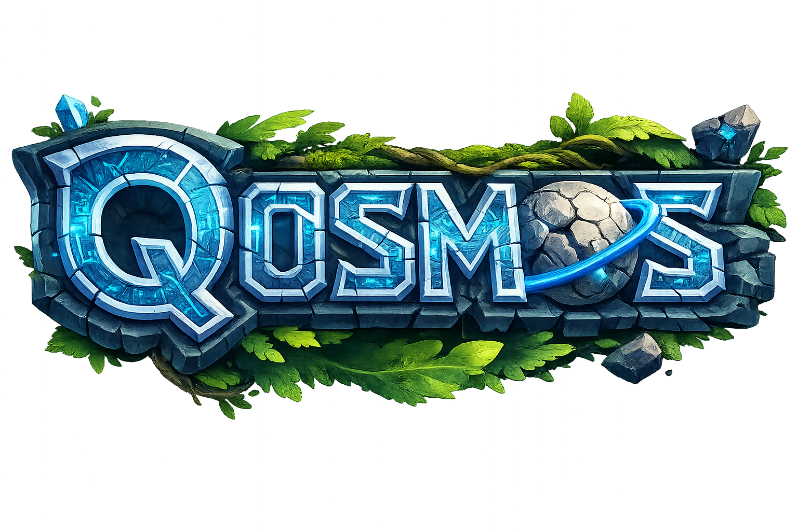

<p align="center">
    
</p>

<p align="center">
    <a href="https://github.com/AerafalDev/Qosmos/blob/main/LICENSE">
        
    </a>
    <a href="https://github.com/AerafalDev/Qosmos/actions/workflows/ci.yml">
        
    </a>
    <a href="https://github.com/AerafalDev/Qosmos/actions/workflows/codeql.yml">
        
    </a>
</p>


<hr>

##  Quick Links

> - [📍 Overview](#overview)
> - [✨ Features](#features)
> - [🚀 Getting Started](#getting-started)
>   - [⚙️ Installation](#installation)
>   - [🎮 Running Qosmos](#running-qosmos)
>   - [🧪 Tests](#tests)
> - [🤝 Contributing](#contributing)
> - [📄 License](#license)
> - [🙏 Acknowledgments](#acknowledgments)

---

##  Overview

Qosmos is a high-performance C# rewrite of the Hytale server, originally developed in Java. This project serves as a Proof of Concept (POC) for reverse engineering and reimplementing the server architecture in the .NET ecosystem. It emphasizes code quality, maintainability, and scalability. With automated CI/CD pipelines via GitHub Actions and a modular, multi-assembly architecture, this project offers cutting-edge features while ensuring reliability and ease of use.

---

##  Features

|    | Feature           | Description                                                                                                                |
|----|-------------------|----------------------------------------------------------------------------------------------------------------------------|
| ⚙️  | **Architecture**  | A C# solution structured with multiple projects in a single solution file (.sln), emphasizing modularity. Utilizes custom attributes and follows C# best practices. |
| 🔩 | **Code Quality**  | Adopts code formatting tools such as EditorConfig or dotnet-format. Utilizes Roslyn analyzers and StyleCop for code consistency and maintainability.        |
| 📄 | **Documentation** | Dependabot and GitHub Actions suggest automated documentation deployments. XML comments in `.csproj` files and inline comments imply good documentation practices. |
| 🔌 | **Integrations**  | Uses GitHub Actions for CI/CD, enabling automated linting, builds, testing, and possibly deployment.                                           |
| 🧩 | **Modularity**    | Structured as a solution with multiple projects, enabling code reusability and separation of concerns within differently scoped libraries or applications.         |
| 🧪 | **Testing**       | GitHub Actions indicates testing as part of the CI process. Common test frameworks include xUnit.                               |
| ⚡️  | **Performance**   | C# and .NET provide performance advantages over the original Java implementation, with potential for improved runtime efficiency.                         |
| 🛡️ | **Security**      | Dependabot is configured for automatic dependency updates to mitigate vulnerabilities. Further audit required for specific security implementations.              |
| 📦 | **Dependencies**  | Direct dependencies include C# specific libraries and NuGet packages. Uses NuGet for standard package management practices.                              |
| 🚀 | **Scalability**   | .NET's performance and the project's modularity favor scalability, but actual scalability would depend on specific implementation within the projects.               |

---

##  Getting Started

***Requirements***

Ensure you have the following dependencies installed on your system:

* **.NET 10 SDK**: The software development kit required to build and run C# applications.
* **C#**: The programming language used to develop this project.
* **Docker**: The platform used for containerization, allowing you to run applications in isolated environments.

###  Installation

1. Clone the Qosmos repository:
```sh
git clone https://github.com/AerafalDev/Qosmos.git
```

2. Change to the project directory:
```sh
cd Qosmos
```

3. Install the dependencies:
```sh
> dotnet restore
> dotnet build --no-restore
```

###  Running Qosmos

Use the following command to run Qosmos:
```sh
> dotnet run --project src/Qosmos
```

###  Tests

To execute tests, run:
```sh
> dotnet test
```

---

##  Contributing

Contributions are welcome! Here are several ways you can contribute:

- **[Submit Pull Requests](CONTRIBUTING.md)**: Review open PRs, and submit your own PRs.
- **[Report Issues](issues)**: Submit bugs found or log feature requests for Qosmos.

<details closed>
    <summary>Contributing Guidelines</summary>

1. **Fork the Repository**: Start by forking the project repository to your GitHub account.
2. **Clone Locally**: Clone the forked repository to your local machine using a Git client.
```sh
   git clone https://github.com/AerafalDev/Qosmos
```
3. **Create a New Branch**: Always work on a new branch, giving it a descriptive name.
```sh
   git checkout -b new-feature-x
```
4. **Make Your Changes**: Develop and test your changes locally.
5. **Commit Your Changes**: Commit with a clear message describing your updates.
```sh
   git commit -m 'Implemented new feature x.'
```
6. **Push to GitHub**: Push the changes to your forked repository.
```sh
   git push origin new-feature-x
```
7. **Submit a Pull Request**: Create a PR against the original project repository. Clearly describe the changes and their motivations.

Once your PR is reviewed and approved, it will be merged into the main branch.

</details>

---

##  License

This project is protected under the [MIT](https://choosealicense.com/licenses/mit) License. For more details, refer to the [LICENSE](LICENSE.md) file.

---

##  Acknowledgments

- Hypixel Studios for creating Hytale
- The reverse engineering community for their tools and support
- Contributors and testers who help improve this project

---

## ⚠️ Disclaimer

This project is for educational purposes only. It is not affiliated with or endorsed by Hypixel Studios. Use at your own risk.
